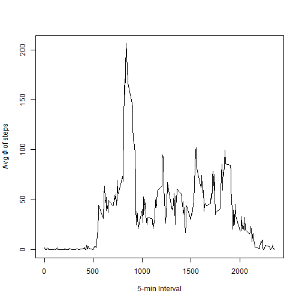
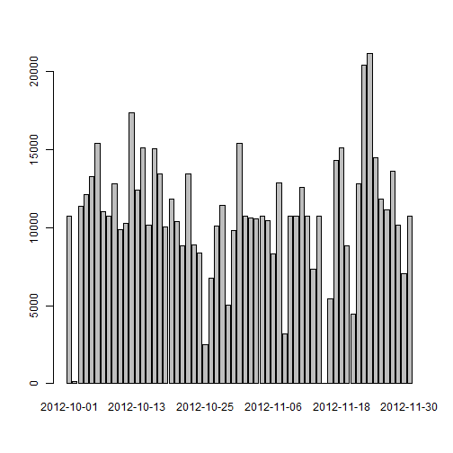
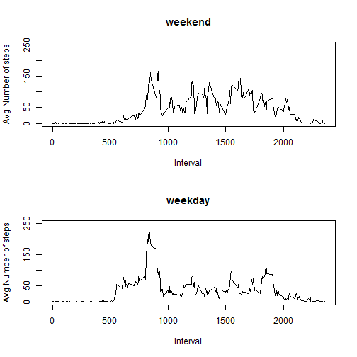

Peer Assessment Assignment 1
=========================

This is the Rmarkdown file for my peer assessment assignment 1.

## Step 1. Loading the Preprocessing the data.
1. Read "activity.csv" file by using read.csv function
2. Filter out the NA values by using complete.cases
3. Change the format of "date" variable into data by using as.Date


```r
data <- read.csv("activity.csv", header=T)
data_tidy <- data[complete.cases(data),]
data_tidy$date <- as.Date(data_tidy$date)
```

## Step 2. What is mean total number of steps taken per day?
* Make a histogram of the total number of steps taken each day by using aggregate and barplot function


```r
Total_Steps_by_day <- aggregate(data_tidy$steps, list(data_tidy$date),sum)
barplot(Total_Steps_by_day$x, names.arg=Total_Steps_by_day$Group.1)
```

 

* Calculate and report the mean total number of steps taken per day


```r
mean(Total_Steps_by_day$x) 
```

```
## [1] 10766
```

* Calculate and report the median total number of steps taken per day


```r
median(Total_Steps_by_day$x) 
```

```
## [1] 10765
```

## Step 3. What is the average daily activity pattern?
* Make a time series plot of the 5-minute interval  and the average number of steps by using aggregate and plot function


```r
Mean_steps_by_interval <- aggregate(data_tidy$steps, list(data_tidy$interval),mean)
with(Mean_steps_by_interval, plot(Group.1, x, type="l",xlab="5-min Interval", ylab="Avg # of steps"))
```

 

* Which 5-minute interval, on average across all the days in the dataset, contains the maximum number of steps?


```r
Mean_steps_by_interval[which(Mean_steps_by_interval$x == max(Mean_steps_by_interval$x)),1]
```

```
## [1] 835
```

## Step 4. Imputing missing values

* Calculate and report the total number of missing values in the dataset by using complete.cases function and summing the output vector


```r
sum(!complete.cases(data))
```

```
## [1] 2304
```

* Devise a strategy for filling in all of the missing values in the dataset. - I will fill the NAs with the average of that 5 min interval.

* Create a new dataset that is equal to the original dataset but with the missing data filled in by using for-loop


```r
data_fillingNA <- data
data_fillingNA$date <- as.Date(data_fillingNA$date)
for (i in 1:length(data$steps)) {
  if (is.na(data_fillingNA[i,1])) {
    data_fillingNA[i,1] <- as.numeric(Mean_steps_by_interval[(data_fillingNA[i,3]==Mean_steps_by_interval[,1]),2])
  }  
}
head(data_fillingNA)
```

```
##     steps       date interval
## 1 1.71698 2012-10-01        0
## 2 0.33962 2012-10-01        5
## 3 0.13208 2012-10-01       10
## 4 0.15094 2012-10-01       15
## 5 0.07547 2012-10-01       20
## 6 2.09434 2012-10-01       25
```

* Make a histogram of the total number of steps taken each day and Calculate and report the mean and median total number of steps taken per day. 


```r
Total_Steps_by_day_fillingNA <- aggregate(data_fillingNA$steps, list(data_fillingNA$date),sum)
barplot(Total_Steps_by_day_fillingNA$x, names.arg=Total_Steps_by_day_fillingNA$Group.1)
```

 

```r
mean(Total_Steps_by_day_fillingNA$x) 
```

```
## [1] 10766
```

```r
median(Total_Steps_by_day_fillingNA$x) 
```

```
## [1] 10766
```

 * Do these values differ from the estimates from the first part of the assignment? - No significant difference
 
 * What is the impact of imputing missing data on the estimates of the total daily number of steps? - No huge impact

## Step 5. Are there differences in activity patterns between weekdays and weekends?

* Create a new factor variable in the dataset with two levels - "weekday" and "weekend".


```r
Weekday_of_date <- weekdays(data_fillingNA$date, abbreviate = FALSE)
data_fillingNA$Weekend_or_not <- vector(length=length(data_fillingNA$steps))

data_fillingNA$Weekend_or_not[Weekday_of_date=="Sunday" | Weekday_of_date=="Saturday"] <- "weekend"
data_fillingNA$Weekend_or_not[Weekday_of_date!="Sunday" & Weekday_of_date!="Saturday"] <- "weekday"

data_fillingNA$Weekend_or_not <- as.factor(data_fillingNA$Weekend_or_not)
```

* Make a panel plot containing a time series plot  of the 5-minute interval and the average number of steps taken by splitting into weekend factor and using base plotting system


```r
Mean_steps_by_interval_fillingNA <- aggregate(data_fillingNA$steps, list(data_fillingNA$interval,data_fillingNA$Weekend_or_not),mean)

par(mfrow = c(2,1))
plot(Mean_steps_by_interval_fillingNA[Mean_steps_by_interval_fillingNA$Group.2=="weekend",1], Mean_steps_by_interval_fillingNA[Mean_steps_by_interval_fillingNA$Group.2=="weekend",3], xlab = "Interval", ylab = "Avg Number of steps", type="l", main="weekend", ylim=c(0,250))
plot(Mean_steps_by_interval_fillingNA[Mean_steps_by_interval_fillingNA$Group.2=="weekday",1], Mean_steps_by_interval_fillingNA[Mean_steps_by_interval_fillingNA$Group.2=="weekday",3], xlab = "Interval", ylab = "Avg Number of steps", type="l",main="weekday",ylim=c(0,250))
```

 

